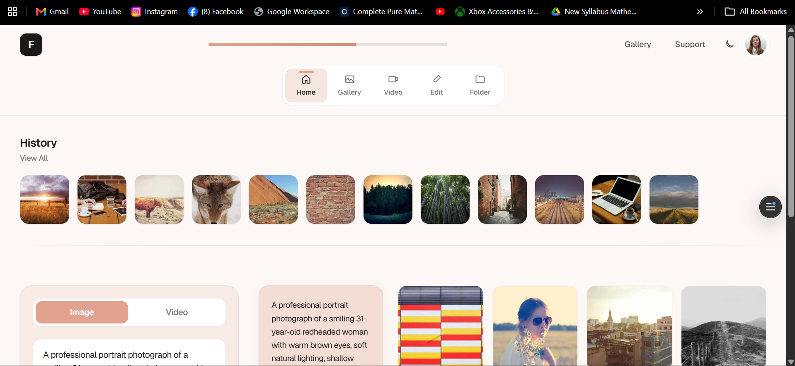
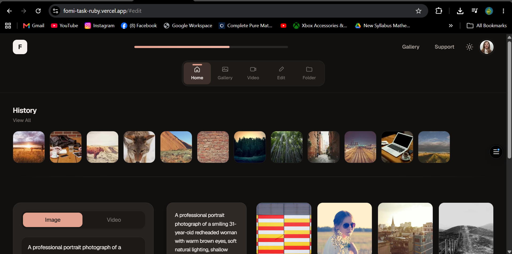
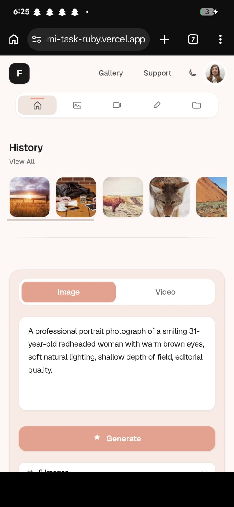
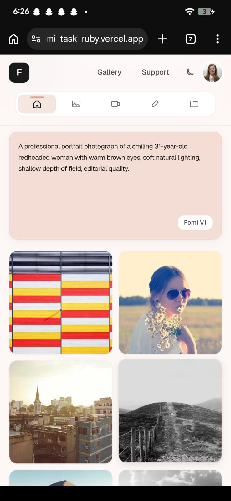
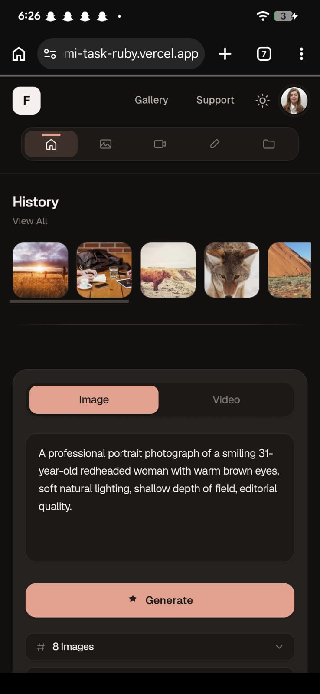
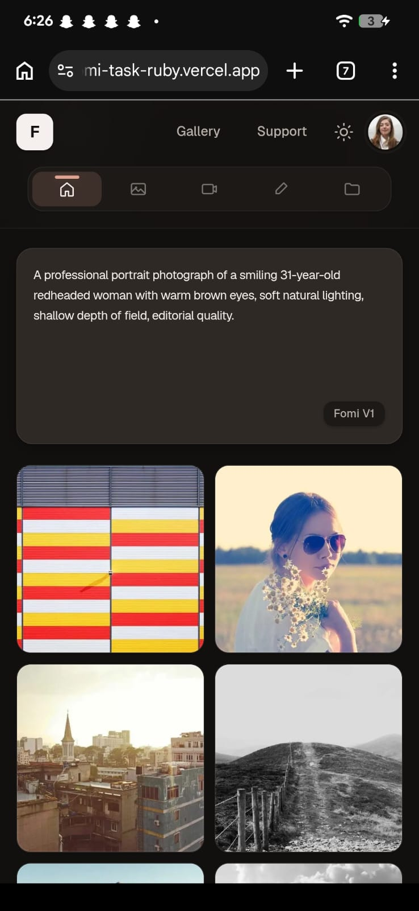

# Fomi — AI Content Generation

Frontend technical assessment submission for **Tarum** — a responsive, production-quality implementation of the Fomi AI image and video generation interface.

**Live demo:** [https://fomi-task-ruby.vercel.app/](https://fomi-task-ruby.vercel.app/)  
**Repository:** [github.com/inamullahshaikh/fomi-task](https://github.com/inamullahshaikh/fomi-task)

---

## Project Overview

This application converts the provided Fomi design mockup into a fully functional Next.js web page. Users can switch between image and video generation, enter prompts, configure parameters, and view results fetched from a mock API — including loading, empty, and error states.

The UI is mobile-first, accessible, and optimized from 320px mobile viewports through ultrawide desktop displays.

---

## Screenshots

Responsiveness was tested on a **Google Pixel 7 Pro** (mobile) and a **laptop** (desktop). Screenshots below confirm layout, spacing, and theme behaviour on both devices.

### Desktop (Laptop)

| Light mode | Dark mode |
|------------|-----------|
|  |  |

### Mobile (Google Pixel 7 Pro)

| Light mode — controls | Light mode — results |
|-----------------------|----------------------|
|  |  |

| Dark mode — controls | Dark mode — results |
|----------------------|---------------------|
|  |  |

**Responsiveness confirmation:** Tested and verified on Google Pixel 7 Pro (mobile) and laptop (desktop). Screenshots above document both light and dark themes on each device.

---

## Tech Stack

| Layer | Choice |
|-------|--------|
| Framework | Next.js 16 (App Router) |
| Language | JavaScript |
| Styling | Tailwind CSS v4 + CSS Modules |
| Images | `next/image` with remote pattern config |
| API | Next.js Route Handlers (mock backend) |
| State | React hooks (no external state library) |
| Deployment | Vercel |

---

## Getting Started

### Prerequisites

- Node.js 18+
- npm

### Installation

```bash
git clone https://github.com/inamullahshaikh/fomi-task.git
cd fomi-task
npm install
```

### Run locally

```bash
npm run dev
```

Open [http://localhost:3000](http://localhost:3000).

### Production build

```bash
npm run build
npm start
```

---

## Mock API

All generated content is served through Next.js API routes — nothing is hardcoded in components.

| Endpoint | Method | Description |
|----------|--------|-------------|
| `/api/history` | GET | Returns history thumbnail items |
| `/api/content?type=image\|video` | GET | Returns generated content |
| `/api/content?state=empty\|error` | GET | Simulates empty/error states |
| `/api/generate` | POST | Simulates generation with ~2.2s delay |

**Generate request body:**

```json
{
  "prompt": "Your prompt here",
  "type": "image",
  "imageCount": 8,
  "aspectRatio": "1:1",
  "model": "fomi-v1"
}
```

---

## Folder Structure

```
├── app/
│   ├── api/                  # Mock backend route handlers
│   ├── globals.css           # Design tokens and theme variables
│   ├── layout.js
│   └── page.js
├── components/
│   ├── generation/           # Workspace, sidebar, results grid
│   ├── history/              # History scroll bar
│   ├── icons/                # Inline SVG icons
│   ├── layout/               # Navbar, main layout
│   └── ui/                   # Reusable Button, Card, Dropdown, etc.
├── context/                  # Theme provider (light/dark)
├── hooks/                    # useContent, useGenerate, useHistory
├── lib/                      # API client, constants, mock data
├── screenshots/              # Responsiveness test captures
├── next.config.mjs
├── vercel.json
└── package.json
```

---

## Design Decisions

- **Design tokens via CSS variables** — Colors, radii, and shadows live in `globals.css` for consistent theming and dark mode.
- **CSS Modules where scoped styles help** — Progress bar, history scroll, and results grid use modules; Tailwind handles everything else.
- **No icon library** — Custom inline SVGs keep the bundle small and match the mockup stroke style.
- **API-driven content** — Images, videos, history, and generation states all flow through route handlers.
- **Seeded placeholder images** — Picsum Photos URLs provide stable media without bundling large assets.

---

## Responsiveness Strategy

| Viewport | Layout behaviour |
|----------|------------------|
| Mobile (320px+) | Single column; sidebar first, then results; 2-column image grid |
| Tablet (640px+) | 3-column results grid; nav labels visible |
| Desktop (1024px+) | Sidebar and results side-by-side; 4-column image grid |
| Ultrawide | Content capped at 1600px to prevent over-stretching |

Breakpoints were validated on **Google Pixel 7 Pro** (mobile) and a **laptop** (desktop). See [Screenshots](#screenshots) above.

---

## Performance

- `memo()` on expensive leaf components (Navbar, HistoryBar, ResultsGrid, PromptCard)
- `next/image` with responsive `sizes` attribute
- Video `preload="metadata"` to avoid eager loading
- Skeleton loaders to prevent layout shift during fetch
- No unnecessary third-party dependencies

---

## Accessibility

- Semantic HTML (`header`, `nav`, `main`, `section`, `aside`)
- ARIA labels on icon buttons, dropdowns, and tab controls
- Keyboard-accessible dropdowns (Escape to close)
- Visible focus rings with accent colour
- `prefers-reduced-motion` respected
- Sufficient colour contrast in light and dark themes

---

## Deploy to Vercel

**Deployed app:** [https://fomi-task-ruby.vercel.app/](https://fomi-task-ruby.vercel.app/)

| Setting | Value |
|---------|-------|
| Framework Preset | Next.js |
| Root Directory | `.` |
| Build Command | `npm run build` |
| Output Directory | *(leave empty)* |
| Install Command | `npm install` |

> Do not set Output Directory to `public` — Next.js outputs to `.next`, which Vercel handles automatically.

---

## Future Improvements

- Real backend integration with streaming generation progress
- Image lightbox with download and remix actions
- Virtualized history scroll for large libraries
- E2E tests with Playwright

---

Built for the Tarum Frontend Developer Technical Assessment.
